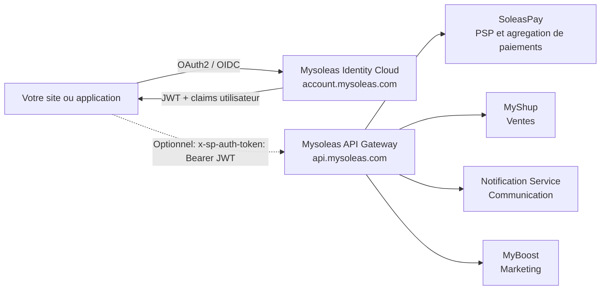

La nouvelle architecture Mysoleas separe clairement l'infrastructure commune et les corps de metier.

L'infrastructure gere les points d'entree publics, l'identite, la securite, le routage et le contexte. Les corps de metier portent les produits: paiements, utilisateurs, ventes, notifications et campagnes marketing.



## Infrastructure et metiers

| Type | Nom | Role |
| --- | --- | --- |
| Infrastructure | Mysoleas API Gateway | Point d'entree unique pour les routes metier protegees |
| Infrastructure | Mysoleas Identity Cloud | Authentification, gestion utilisateur, OAuth2/OIDC, JWT, userinfo et bouton de connexion |
| Metier | SoleasPay | Payment service processor, collections, disbursements, liens, souscriptions et providers |
| Metier | MyShup | Gestion et automatisation des ventes |
| Metier | Notification Service | Communications transactionnelles et notifications applicatives |
| Metier | MyBoost | Campagnes boost et marketing |

## `account.mysoleas.com`

Le domaine account correspond a Mysoleas Identity Cloud. C'est un service a part entiere, pas une simple dependance technique.

Utilisez-le pour:

- integrer le bouton **Se connecter avec Mysoleas**;
- authentifier un utilisateur avec OAuth2/OIDC;
- gerer la couche identite et utilisateur d'une application tierce;
- obtenir un JWT;
- rafraichir ou revoquer un jeton;
- lire les claims utilisateur avec `/oauth/v2/userinfo`;
- permettre a une application tierce d'agir dans le contexte d'un utilisateur ou d'un client autorise.

Ce service peut etre utilise sans la gateway. Si votre besoin est uniquement d'authentifier vos utilisateurs et d'ouvrir une session dans votre propre application, vous pouvez vous arreter a Identity Cloud.

Pour creer une application OAuth2, l'utilisateur doit avoir un compte Mysoleas, se connecter au dashboard `https://mysoleas.com`, puis parametrer son application, ses URLs de redirection et ses scopes.

## `api.mysoleas.com`

Le domaine API est la gateway publique. Votre integration ne doit pas appeler les microservices internes directement.

Toutes les routes gateway attendent le JWT dans le header `x-sp-auth-token`.

```bash
curl "https://api.mysoleas.com/service/list?country=CMR&currency=XAF" \
  -H "x-sp-auth-token: Bearer YOUR_ACCESS_TOKEN"
```

Utilisez-le pour:

- lister les pays;
- lister les services de paiement;
- verifier les providers actifs;
- creer et suivre des collections;
- creer et suivre des disbursements;
- creer des liens de paiement;
- gerer les souscriptions;
- piloter les autres domaines metier exposes progressivement par Mysoleas.

## Regle d'authentification gateway

La gateway attend toujours le meme header:

```txt
x-sp-auth-token: Bearer <JWT>
```

Cette convention evite de confondre l'authentification gateway avec d'autres headers utilises par les providers, les plugins ou les frontends.

| Contexte | Domaine | Credential |
| --- | --- | --- |
| Connexion et gestion utilisateur | `account.mysoleas.com` | OAuth2/OIDC |
| Appel gateway metier | `api.mysoleas.com` | `x-sp-auth-token: Bearer <JWT>` |
| Checkout v3 | `pay.soleaspay.com` | `apiKey` marchand |
| Button v3 | `btn.soleaspay.com` | `data-apikey` marchand |

## Domaines metier dans l'ecosysteme

### SoleasPay

SoleasPay est le payment service processor de Mysoleas. Il agrege les moyens de paiement et expose les flux de collection, disbursement, souscription, lien de paiement, services, pays et providers.

### Mysoleas Identity Cloud

Identity Cloud gere les utilisateurs, les applications OAuth2, les tokens JWT et les claims. Il peut servir de service d'identite autonome pour une application tierce, ou fournir le JWT utilise ensuite par la gateway.

### MyShup

MyShup porte la gestion et l'automatisation des ventes. Il intervient dans les parcours commerciaux, les commandes et les operations marchandes.

### Notification Service

Le Notification Service centralise les communications transactionnelles: confirmations, alertes, messages systeme et notifications liees aux evenements.

### MyBoost

MyBoost couvre le marketing à travers des campagnes de challenges personalisé pour favoriser le marketing UGC, des promotions.

## Flux de paiement standard

Les collections et disbursements utilisent un modele en trois etapes.

| Etape | Role |
| --- | --- |
| `intent` | Cree une intention idempotente et retourne une reference Mysoleas |
| `execute` | Lance l'operation chez le provider ou dans le wallet |
| `status` | Synchronise et retourne l'etat courant de la transaction |

Ce modele evite les doubles debits. Il vous donne aussi un point clair pour reprendre une transaction apres un timeout reseau.

## Flux plugin SoleasPay

Les plugins SoleasPay v3 ne suivent pas le meme modele que les appels gateway serveur a serveur.

| Plugin | URL | Authentification | Role |
| --- | --- | --- | --- |
| Checkout v3 | `https://pay.soleaspay.com` | `apiKey` | Page de paiement hebergee |
| Button v3 | `https://btn.soleaspay.com/main.js` | `data-apikey` | Bouton JavaScript integre dans votre page |

Utilisez ces plugins pour une integration paiement rapide lorsque vous ne voulez pas gerer directement OAuth2, JWT, `intent`, `execute` et `status`.

## Donnees de contexte

La gateway transporte le contexte de l'utilisateur et du tenant dans les claims du jeton. Elle peut aussi forwarder certains headers internes ou de trace.

| Donnee | Source recommandee |
| --- | --- |
| Utilisateur | Claim `sub` |
| Tenant marchand | Claim `tenant_id` |
| Pays actif | Claim ou header `X-SP-Country` |
| Environnement | Claim ou header `X-SP-Environment` |
| Trace applicative | Header `X-Request-Id` |

## Etats importants

Une transaction peut passer par plusieurs etats non finaux avant d'aboutir.

| Statut | Signification |
| --- | --- |
| `INITIATED` | L'intention existe mais l'execution n'est pas encore lancee |
| `PENDING` | Mysoleas prepare l'operation |
| `SUBMITTED` | La demande est transmise au provider |
| `PROCESSING` | Le provider ou le wallet traite encore l'operation |
| `COMPLETED` | Operation terminee avec succes |
| `FAILED` | Operation echouee |
| `CANCELLED` | Operation annulee |
| `REFUNDED` | Operation remboursee |

Traitez `COMPLETED`, `FAILED`, `CANCELLED` et `REFUNDED` comme des etats finaux.
