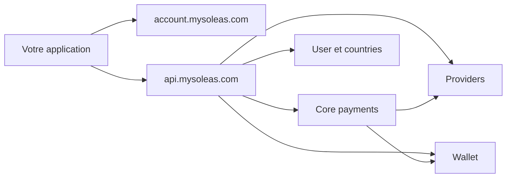

La nouvelle architecture Mysoleas separe l'authentification, l'orchestration publique et les traitements metier.

## Les deux points d'entree

### `account.mysoleas.com`

Le domaine account gere OAuth 2.0, les jetons, la decouverte OIDC, le profil utilisateur et les clients OAuth.

Utilisez-le pour:

- creer ou configurer une application OAuth;
- obtenir un `access_token`;
- rafraichir ou revoquer un jeton;
- lire les claims utilisateur avec `/oauth/v2/userinfo`.

### `api.mysoleas.com`

Le domaine API est la gateway publique. Votre integration ne doit pas appeler les microservices internes directement.

Utilisez-le pour:

- lister les pays;
- lister les services de paiement;
- verifier les providers actifs;
- creer et suivre des collections;
- creer et suivre des disbursements;
- creer des liens de paiement;
- gerer les souscriptions;
- utiliser les endpoints plugin marchand.

## Flux de paiement standard

Les collections et disbursements utilisent un modele en trois etapes.

| Etape | Role |
| --- | --- |
| `intent` | Cree une intention idempotente et retourne une reference Mysoleas |
| `execute` | Lance l'operation chez le provider ou dans le wallet |
| `status` | Synchronise et retourne l'etat courant de la transaction |

Ce modele evite les doubles debits. Il vous donne aussi un point clair pour reprendre une transaction apres un timeout reseau.

## Flux plugin

Le plugin marchand utilise un flux plus compact.

| Endpoint | Role |
| --- | --- |
| `POST /merchand/collection` | Cree et execute une collection en un appel |
| `POST /merchand/status` | Retourne le statut de la collection plugin |
| `GET /merchand/services` | Retourne les services actifs autorises pour le marchand |

Utilisez ce flux pour WooCommerce, Prestashop, Shopify custom apps, marketplaces et tout plugin qui veut limiter le nombre d'appels serveur.

## Donnees de contexte

La gateway transporte le contexte de l'utilisateur et du tenant dans les claims du jeton. Elle peut aussi forwarder certains headers internes ou de trace.

| Donnee | Source recommandee |
| --- | --- |
| Utilisateur | Claim `sub` |
| Tenant marchand | Claim `tenant_id` |
| Pays actif | Claim ou header `X-SP-Country` |
| Environnement | Claim ou header `X-SP-Environment` |
| Trace applicative | Header `X-Request-Id` |

## Etats importants

Une transaction peut passer par plusieurs etats non finaux avant d'aboutir.

| Statut | Signification |
| --- | --- |
| `INITIATED` | L'intention existe mais l'execution n'est pas encore lancee |
| `PENDING` | Mysoleas prepare l'operation |
| `SUBMITTED` | La demande est transmise au provider |
| `PROCESSING` | Le provider ou le wallet traite encore l'operation |
| `COMPLETED` | Operation terminee avec succes |
| `SUCCESS` | Operation terminee avec succes, selon certains providers |
| `FAILED` | Operation echouee |
| `CANCELLED` | Operation annulee |
| `REFUNDED` | Operation remboursee |

Traitez `COMPLETED`, `SUCCESS`, `FAILED`, `CANCELLED` et `REFUNDED` comme des etats finaux.
