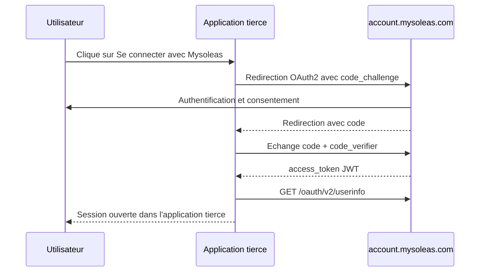

Mysoleas Identity Cloud est le service d'identite de l'ecosysteme Mysoleas. Vous pouvez l'integrer dans votre site, votre application mobile ou votre SaaS pour gerer l'authentification et la gestion des utilisateurs sans reconstruire toute cette couche vous-meme.

Concretement, votre application peut utiliser Mysoleas Identity Cloud pour:

- afficher le bouton **Se connecter avec Mysoleas**;
- authentifier un utilisateur avec OAuth2/OIDC;
- recuperer un JWT et les claims utilisateur;
- lire le profil utilisateur avec `userinfo`;
- deleguer la gestion de session et d'identite a Mysoleas;
- se concentrer sur le metier propre de votre application.

Vous n'avez pas besoin d'appeler la gateway pour utiliser Identity Cloud. La gateway devient utile seulement si votre application consomme ensuite les services metier Mysoleas, comme SoleasPay.

Le service public d'authentification est:

```txt
https://account.mysoleas.com
```

La gateway publique est optionnelle dans un parcours purement identite:

```txt
https://api.mysoleas.com
```

## Creer une application OAuth2

Avant d'utiliser OAuth2, vous devez creer une application dans le dashboard Mysoleas.

1. Creez ou utilisez un compte Mysoleas.
2. Connectez-vous au dashboard:

```txt
https://mysoleas.com
```

3. Ouvrez la section dediee aux applications OAuth2.
4. Creez une nouvelle application.
5. Configurez vos URLs de redirection autorisees.
6. Copiez le `client_id` et, si votre type d'application le permet, le `client_secret`.
7. Activez les scopes necessaires a votre integration.

<Tip>
  Pour une application web ou mobile cote utilisateur, preferez `authorization_code` avec PKCE. Ne placez jamais un `client_secret` dans une application frontend.
</Tip>

## Trois usages differents

| Usage | Domaine | Credential obtenu | Header ensuite utilise |
| --- | --- | --- | --- |
| Authentifier vos utilisateurs uniquement | `account.mysoleas.com` | JWT utilisateur et claims | Votre session applicative |
| Authentifier puis appeler la gateway | `account.mysoleas.com` puis `api.mysoleas.com` | JWT utilisateur ou application | `x-sp-auth-token: Bearer <JWT>` |
| Appel serveur a serveur vers vos propres backends | `account.mysoleas.com` | JWT application | Validation cote backend |
| Plugin Checkout v3 ou Button v3 | `pay.soleaspay.com` ou `btn.soleaspay.com` | Aucun JWT | `apiKey` ou `data-apikey` |

<Warning>
  Si vous appelez la gateway Mysoleas, les routes protegees n'attendent pas le token dans `Authorization`. Envoyez le Bearer JWT dans `x-sp-auth-token`.
</Warning>

## Choisir le bon flow

| Flow | Quand l'utiliser |
| --- | --- |
| `authorization_code` avec PKCE | Site web, application mobile ou application tierce qui affiche **Se connecter avec Mysoleas** |
| `client_credentials` | Backend, worker, synchronisation de statut ou integration qui agit en son propre nom |
| `refresh_token` | Renouveler une session longue sans redemander les identifiants |

## Integrer Se connecter avec Mysoleas

Le flow recommande pour une application tierce est `authorization_code` avec PKCE.



Votre bouton doit rediriger l'utilisateur vers l'endpoint d'autorisation Mysoleas avec les parametres OAuth2 de votre application.

```txt
https://account.mysoleas.com/oauth/v2/authorize
```

Parametres usuels:

| Parametre | Description |
| --- | --- |
| `client_id` | Identifiant de votre application OAuth |
| `redirect_uri` | URL de retour autorisee dans Mysoleas |
| `response_type` | `code` |
| `scope` | Permissions demandees, par exemple `openid profile email payments` |
| `state` | Valeur aleatoire pour proteger le retour |
| `code_challenge` | Challenge PKCE |
| `code_challenge_method` | `S256` |

## Utiliser Identity Cloud sans gateway

Si votre application veut seulement deleguer l'authentification a Mysoleas, le flux s'arrete apres la validation du JWT et la lecture de `userinfo`.

Votre backend peut alors:

- creer ou retrouver l'utilisateur local correspondant au claim `sub`;
- rattacher l'utilisateur a une organisation, un espace de travail ou un tenant de votre application;
- ouvrir une session applicative;
- appliquer vos propres roles et permissions;
- continuer a utiliser vos propres APIs metier sans passer par `api.mysoleas.com`.

Dans ce mode, Mysoleas Identity Cloud remplace la brique identite de votre application. Il ne vous oblige pas a utiliser la gateway.

## Demander un token

Apres le retour OAuth2, votre backend echange le `code` contre un token.

Pour une integration serveur a serveur, utilisez directement le grant `client_credentials`.

```bash
curl -X POST "https://account.mysoleas.com/oauth/v2/token" \
  -H "Content-Type: application/json" \
  -d '{
    "grant_type": "client_credentials",
    "client_id": "YOUR_CLIENT_ID",
    "client_secret": "YOUR_CLIENT_SECRET",
    "scope": "payments services countries providers"
  }'
```

La reponse suit le format OAuth.

```json
{
  "token_type": "Bearer",
  "expires_in": 3600,
  "access_token": "eyJ..."
}
```

## Appeler l'API

Si votre application consomme ensuite les services metier Mysoleas, toutes les routes gateway protegees attendent le jeton dans `x-sp-auth-token`.

```bash
curl "https://api.mysoleas.com/service/list" \
  -H "x-sp-auth-token: Bearer YOUR_ACCESS_TOKEN" \
  -H "Accept: application/json"
```

## Utiliser les headers de contexte

Ces headers sont utiles pour les integrations multi-pays, les environnements separes et le debogage.

| Header | Description |
| --- | --- |
| `x-sp-auth-token` | Jeton Bearer JWT obligatoire pour la gateway |
| `X-Request-Id` | Trace id cree par votre systeme |
| `X-Idempotency-Key` | Cle d'idempotence externe quand l'endpoint la supporte |
| `X-SP-Country` | Pays actif, par exemple `CMR` |
| `X-SP-Environment` | `prod` ou `dev` |

## Decouverte OAuth

Vous pouvez lire les metadonnees OAuth et OIDC.

```bash
curl "https://account.mysoleas.com/.well-known/openid-configuration"
```

Cette route indique les endpoints officiels de token, introspection, revocation, JWKS et userinfo.

## Bonnes pratiques

- Ne mettez jamais `client_secret` dans le navigateur.
- Renouvelez le token avant expiration.
- Stockez les tokens en memoire ou dans un coffre adapte a votre backend.
- Utilisez une cle d'idempotence stable pour toute operation qui peut etre rejouee apres timeout.
- Loggez `transaction_reference`, `invoice_reference` et `X-Request-Id` ensemble.
