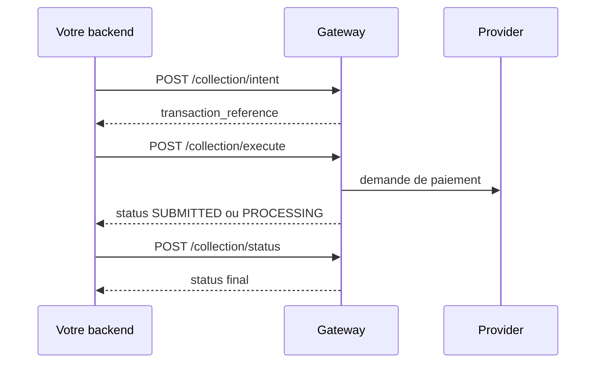

Une collection est une operation Pay-In. Elle debite le wallet ou le compte du client et credite le wallet Mysoleas du marchand.

## Vue d'ensemble



## 1. Creer l'intention

```bash
curl -X POST "https://api.mysoleas.com/collection/intent" \
  -H "Authorization: Bearer YOUR_ACCESS_TOKEN" \
  -H "Content-Type: application/json" \
  -d '{
    "amount": 2500,
    "currency": "XAF",
    "transaction_uuid": "2f8b9a68-1ad3-4a0c-a187-40b91a4c44a1",
    "provider": "CM_MTN_MOMO",
    "channel": "PROVIDER",
    "customer_wallet": "237670000000",
    "description": "Commande MS-10045"
  }'
```

`transaction_uuid` rend l'intention idempotente. Si vous rejouez le meme payload avec le meme UUID, Mysoleas retourne la meme intention.

## 2. Executer

```bash
curl -X POST "https://api.mysoleas.com/collection/execute" \
  -H "Authorization: Bearer YOUR_ACCESS_TOKEN" \
  -H "Content-Type: application/json" \
  -d '{
    "transaction_reference": "TRX-20260728-000001",
    "invoice_reference": "MS-10045"
  }'
```

Ajoutez `otp` si le service choisi indique `is_need_otp: true`.

## 3. Verifier le statut

```bash
curl -X POST "https://api.mysoleas.com/collection/status" \
  -H "Authorization: Bearer YOUR_ACCESS_TOKEN" \
  -H "Content-Type: application/json" \
  -d '{ "transaction_reference": "TRX-20260728-000001" }'
```

L'appel peut synchroniser le statut provider avant de vous repondre.

## Champs de reponse

| Champ | Description |
| --- | --- |
| `transaction_reference` | Reference Mysoleas de la transaction |
| `invoice_reference` | Reference marchand fournie a l'execution |
| `provider_reference` | Reference retournee par le provider |
| `status` | Etat courant |
| `operation` | `COLLECTION` |
| `channel` | `PROVIDER` ou `WALLET` |
| `confirmation_method` | `MSISDN`, `LINK` ou `QRCODE` selon le service |
| `confirmation_url` | URL a presenter au client si la confirmation se fait par lien |

## Split settlement

Pour distribuer un encaissement, utilisez `settlement_mode: "SPLIT"` dans l'intention.

```json
{
  "settlement_mode": "SPLIT",
  "distribution": [
    { "matricule": "MS-SELLER-001", "rate": 85 },
    { "matricule": "MS-MARKET-001", "rate": 15 }
  ]
}
```

Le statut du split apparait dans `split_status` lorsque le paiement est eligible.
