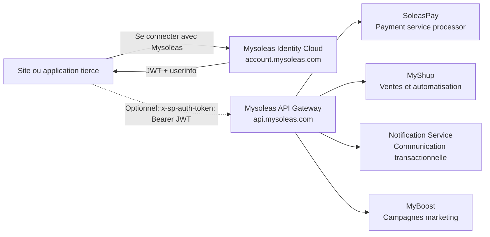

Mysoleas n'est pas une API monolithique. C'est un ecosysteme de services metier exposes a travers une infrastructure commune.

La distinction est importante pour integrer proprement:

- **l'infrastructure** vous donne les points d'entree, l'identite, la securite et le routage;
- **les corps de metier** portent les fonctions business: paiement, ventes, communication, marketing et gestion utilisateur.

## Carte mentale



## Infrastructure Mysoleas

L'infrastructure est la couche transversale. Elle ne remplace pas les produits metier. Elle les rend accessibles de maniere unifiee.

| Composant | Domaine | Role |
| --- | --- | --- |
| Mysoleas API Gateway | `https://api.mysoleas.com` | Point d'entree unique pour les routes metier protegees |
| Mysoleas Identity Cloud | `https://account.mysoleas.com` | Authentification OAuth2/OIDC, gestion utilisateur, JWT, profil utilisateur et bouton de connexion |

La gateway recoit les requetes de vos applications, verifie le contexte de securite, puis route vers le bon domaine metier.

<Warning>
  Toutes les routes de la gateway attendent un JWT Bearer dans le header `x-sp-auth-token`.
</Warning>

```bash
curl "https://api.mysoleas.com/service/list?country=CMR&currency=XAF" \
  -H "x-sp-auth-token: Bearer YOUR_ACCESS_TOKEN" \
  -H "Accept: application/json"
```

## Corps de metier

Chaque corps de metier a son vocabulaire, ses objets et ses flux.

| Domaine | Produit | Ce qu'il permet |
| --- | --- | --- |
| Paiements | SoleasPay | Agregation de paiements, collections, disbursements, liens de paiement, souscriptions, providers et services |
| Identite | Mysoleas Identity Cloud | Connexion utilisateur, gestion des utilisateurs, OAuth2, OIDC, JWT, claims, profil et applications tierces |
| Ventes | MyShup | Gestion et automatisation des ventes, parcours marchands, commandes et operations commerciales |
| Communication | Notification Service | Notifications transactionnelles, messages systeme, alertes et communications liees aux evenements |
| Marketing | MyBoost | Campagnes boost, activation client, promotion et relance marketing |

## SoleasPay dans la gateway

SoleasPay est le payment service processor de l'ecosysteme. Dans cette documentation, les routes gateway couvertes concernent principalement SoleasPay.

Utilisez ces familles de routes pour:

- lister les pays disponibles;
- lister les services de paiement;
- verifier le statut des providers;
- creer et suivre des collections;
- creer et suivre des disbursements;
- creer et gerer des liens de paiement;
- creer et gerer des souscriptions.

Ces routes passent par:

```txt
https://api.mysoleas.com
```

Elles utilisent:

```txt
x-sp-auth-token: Bearer <JWT>
```

## Mysoleas Identity Cloud

Mysoleas Identity Cloud est un service a part entiere. Il sert a integrer le bouton **Se connecter avec Mysoleas** dans un site ou une application tierce.

Vous pouvez l'utiliser comme service d'authentification autonome. Dans ce cas, votre application authentifie l'utilisateur via Mysoleas, lit ses claims, ouvre sa propre session et continue avec son propre metier sans appeler la gateway.

Pour creer une application OAuth2, connectez-vous au dashboard Mysoleas:

```txt
https://mysoleas.com
```

Vous devez y parametrer votre application, vos URLs de redirection et les scopes autorises avant de lancer le parcours OAuth2.

Le parcours recommande pour une application web est le flow OAuth2 `authorization_code` avec PKCE:

1. Votre application affiche **Se connecter avec Mysoleas**.
2. L'utilisateur est redirige vers `account.mysoleas.com`.
3. Mysoleas authentifie l'utilisateur et demande son consentement si necessaire.
4. Votre application recoit un `code`.
5. Votre backend echange le `code` contre un JWT.
6. Votre application ouvre une session locale ou appelle la gateway avec `x-sp-auth-token` si elle consomme un service metier Mysoleas.

Pour un backend qui agit en son propre nom, utilisez `client_credentials`.

## Plugins SoleasPay v3

Les plugins `Checkout v3` et `Button v3` sont un cas volontairement plus simple.

Ils servent a integrer rapidement SoleasPay dans une application tierce avec une `apikey` marchand, sans OAuth2, sans JWT et sans appels gateway manuels.

| Plugin | Authentification | Quand l'utiliser |
| --- | --- | --- |
| Checkout v3 | `apiKey` | Rediriger le client vers la checkout hebergee `https://pay.soleaspay.com` |
| Button v3 | `data-apikey` | Afficher le bouton JavaScript `https://btn.soleaspay.com/main.js` dans votre page |

Si vous construisez un parcours de paiement complet avec vos propres appels backend, utilisez la gateway. Si vous voulez une integration paiement rapide avec tres peu de code, utilisez les plugins v3.
