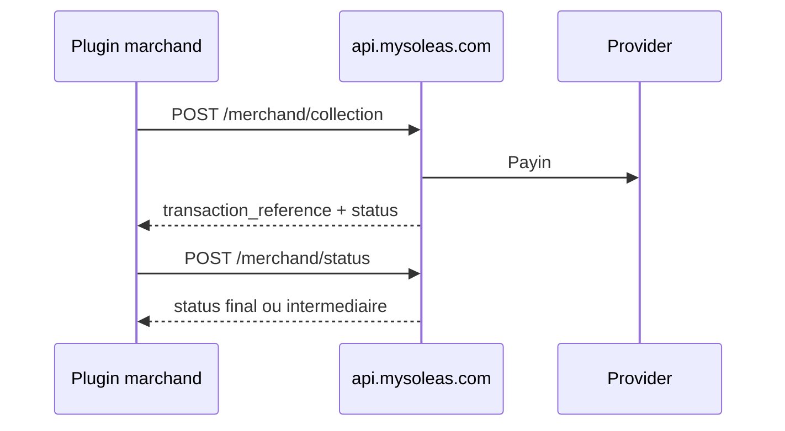

Le flux plugin est fait pour les integrations qui veulent collecter un paiement en un seul appel backend, puis suivre son statut avec une reference Mysoleas.

## Quand utiliser le plugin

Utilisez les endpoints `/merchand/*` si vous construisez:

- un plugin WooCommerce, Prestashop ou autre CMS e-commerce;
- une application marketplace;
- un checkout qui ne veut pas gerer separement `intent` et `execute`;
- une integration qui doit lister uniquement les services actifs autorises pour le marchand.

## Workflow



## Lister les services plugin

```bash
curl "https://api.mysoleas.com/merchand/services?country=CM&currency=XAF" \
  -H "Authorization: Bearer YOUR_ACCESS_TOKEN"
```

Selectionnez un service dont `is_active` et `is_can_collect` valent `true`. Utilisez son `code` dans le champ `provider`.

## Creer une collection plugin

```bash
curl -X POST "https://api.mysoleas.com/merchand/collection" \
  -H "Authorization: Bearer YOUR_ACCESS_TOKEN" \
  -H "Content-Type: application/json" \
  -d '{
    "amount": 2500,
    "currency": "XAF",
    "transaction_uuid": "8db4a998-4cd0-4282-a2e5-8c02b649d601",
    "invoice_reference": "WC-100045",
    "provider": "CM_MTN_MOMO",
    "channel": "PROVIDER",
    "customer_wallet": "237670000000",
    "description": "Commande WooCommerce WC-100045",
    "metadata": {
      "cart_id": "cart_9012"
    }
  }'
```

### Champs importants

| Champ | Obligatoire | Description |
| --- | --- | --- |
| `amount` | Oui | Montant entier dans la devise demandee |
| `currency` | Oui | Devise ISO, par exemple `XAF` |
| `transaction_uuid` | Oui | Identifiant unique cote marchand |
| `invoice_reference` | Oui | Reference de facture ou commande |
| `provider` | Oui | Code du service Mysoleas |
| `customer_wallet` | Oui | Wallet, telephone ou identifiant client a debiter |
| `channel` | Non | `PROVIDER`, `WALLET` ou `AUTO` |
| `otp` | Non | Requis seulement si le service indique `is_need_otp: true` |

## Encaisser avec split

Pour distribuer automatiquement le paiement entre plusieurs beneficiaires, ajoutez `settlement_mode: "SPLIT"` et `distribution`.

```json
{
  "settlement_mode": "SPLIT",
  "distribution": [
    {
      "matricule": "MS-SELLER-001",
      "rate": 80,
      "description": "Part vendeur"
    },
    {
      "matricule": "MS-MARKET-001",
      "rate": 20,
      "description": "Commission marketplace"
    }
  ]
}
```

La somme des `rate` ne doit pas depasser `100`.

## Suivre le statut

```bash
curl -X POST "https://api.mysoleas.com/merchand/status" \
  -H "Authorization: Bearer YOUR_ACCESS_TOKEN" \
  -H "Content-Type: application/json" \
  -d '{
    "transaction_reference": "TRX-20260728-000001"
  }'
```

Votre plugin doit afficher un etat d'attente tant que le statut est `PENDING`, `SUBMITTED` ou `PROCESSING`.
