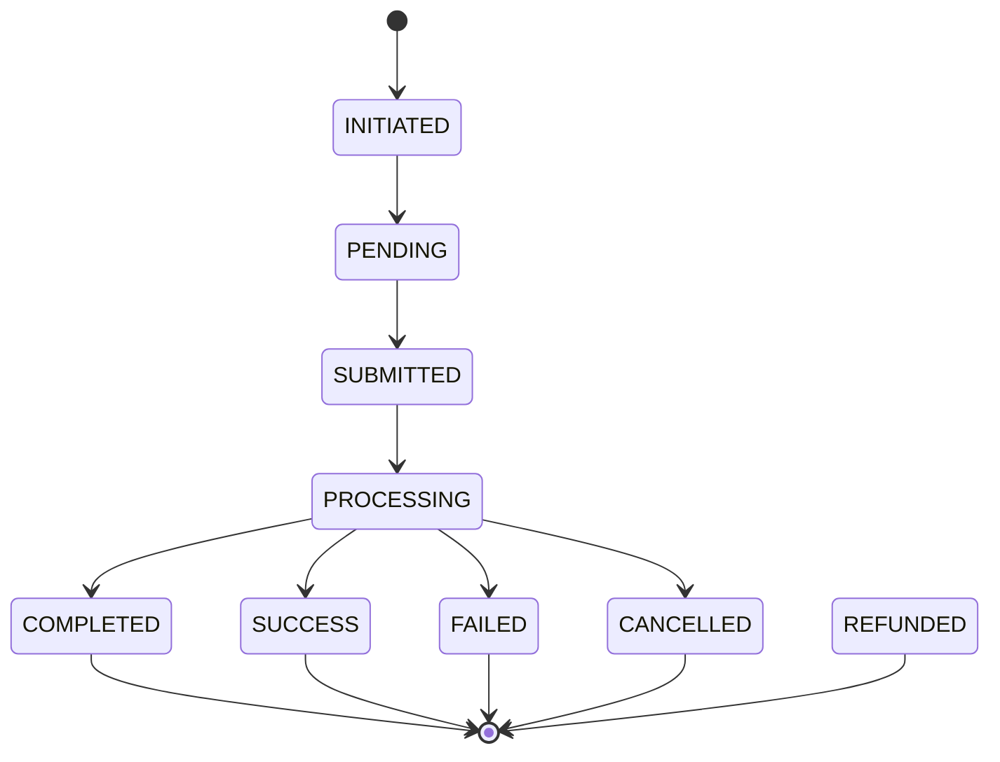

Le statut est la source de verite de votre integration. Ne validez jamais une commande uniquement parce que l'appel d'execution a retourne HTTP `200`.

## Quel endpoint utiliser

| Transaction | Endpoint de statut |
| --- | --- |
| Collection standard | `POST /collection/status` |
| Disbursement standard | `POST /disbursement/status` |
| Collection plugin | `POST /merchand/status` |
| Paiement de lien | Utilisez la `transaction_reference` retournee puis le statut collection |
| Paiement de souscription | `GET /billing/subscription-payments/{reference}` |

## Cycle standard

## Etats non finaux

| Statut | Action recommandee |
| --- | --- |
| `INITIATED` | Attendez l'execution ou relancez `execute` si votre systeme a perdu la reponse |
| `PENDING` | Continuez le polling |
| `SUBMITTED` | Le provider a recu la demande; continuez le polling |
| `PROCESSING` | Le provider traite; continuez le polling avec backoff |

## Etats finaux

| Statut | Action recommandee |
| --- | --- |
| `COMPLETED` | Marquez la transaction comme reussie |
| `SUCCESS` | Marquez la transaction comme reussie |
| `FAILED` | Marquez la transaction comme echouee |
| `CANCELLED` | Marquez la transaction comme annulee |
| `REFUNDED` | Marquez la transaction comme remboursee |

## Strategie de polling

Une strategie simple suffit dans la plupart des cas.

| Moment | Frequence recommandee |
| --- | --- |
| 0 a 60 secondes | Toutes les 5 secondes |
| 1 a 5 minutes | Toutes les 15 secondes |
| 5 a 30 minutes | Toutes les 60 secondes |
| Apres 30 minutes | Toutes les 5 minutes ou traitement manuel |

Arretez le polling des qu'un etat final est retourne.

## Idempotence et reprise

Conservez ces references ensemble:

| Reference | Qui la genere | Utilisation |
| --- | --- | --- |
| `transaction_uuid` | Votre systeme | Eviter les doubles intentions |
| `transaction_reference` | Mysoleas | Executer et suivre la transaction |
| `invoice_reference` | Votre systeme | Relier la transaction a votre facture |
| `provider_reference` | Provider | Diagnostic provider et support |

Si votre appel `execute` timeout, appelez d'abord `status` avec `transaction_reference`. Relancez `execute` seulement si le statut montre que l'operation n'a pas encore ete soumise.
