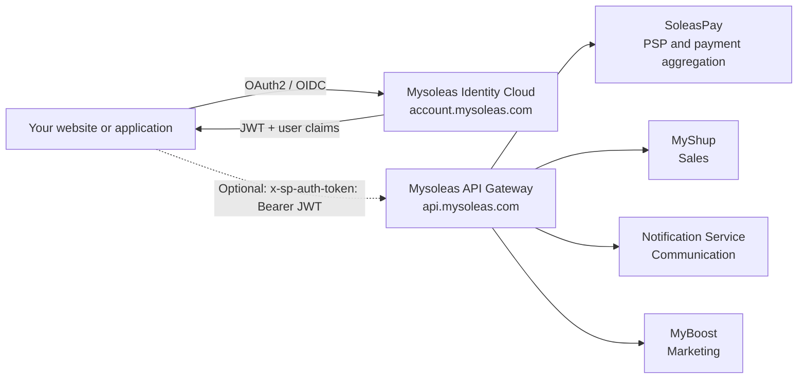

The new Mysoleas architecture clearly separates shared infrastructure from business domains.

Infrastructure manages public entry points, identity, security, routing, and context. Business domains carry the products: payments, users, sales, notifications, and marketing campaigns.



## Infrastructure and business domains

| Type | Name | Role |
| --- | --- | --- |
| Infrastructure | Mysoleas API Gateway | Single entry point for protected business routes |
| Infrastructure | Mysoleas Identity Cloud | Authentication, user management, OAuth2/OIDC, JWT, userinfo, and sign-in button |
| Business domain | SoleasPay | Payment service processor, collections, disbursements, links, subscriptions, and providers |
| Business domain | MyShup | Products, orders, and sales automation |
| Business domain | Notification Service | Transactional communications, contacts, audiences, and V2 marketing campaigns |
| Business domain | MyBoost | Boost campaigns, UGC challenges, promotions, and marketing |

## `account.mysoleas.com`

The account domain is Mysoleas Identity Cloud. It is a full service, not a simple technical dependency.

Use it to:

- integrate the **Sign in with Mysoleas** button;
- authenticate a user with OAuth2/OIDC;
- manage the identity and user layer of a third-party application;
- obtain a JWT;
- refresh or revoke a token;
- read user claims with `/oauth/v2/userinfo`;
- allow a third-party application to act in the context of an authorized user or customer.

This service can be used without the gateway. If your only need is to authenticate users and open a session in your own application, you can stop at Identity Cloud.

To create an OAuth2 application, the user must have a Mysoleas account, sign in to the dashboard at `https://mysoleas.com`, then configure the application, redirect URLs, and scopes.

## `api.mysoleas.com`

The API domain is the public gateway. Your integration should not call internal microservices directly.

All gateway routes expect the JWT in the `x-sp-auth-token` header.

```bash
curl "https://api.mysoleas.com/service/list?country=CMR&currency=XAF" \
  -H "x-sp-auth-token: Bearer YOUR_ACCESS_TOKEN"
```

Use it to:

- list countries;
- list payment services;
- verify active providers;
- create and track collections;
- create and track disbursements;
- create payment links;
- manage subscriptions;
- drive the other business domains progressively exposed by Mysoleas.

## Gateway authentication rule

The gateway always expects the same header:

```txt
x-sp-auth-token: Bearer <JWT>
```

This convention prevents confusion between gateway authentication and other headers used by providers, plugins, or frontends.

| Context | Domain | Credential |
| --- | --- | --- |
| Sign-in and user management | `account.mysoleas.com` | OAuth2/OIDC |
| Business gateway call | `api.mysoleas.com` | `x-sp-auth-token: Bearer <JWT>` |
| Checkout v4 | `pay.soleaspay.com` | Merchant `apiKey` |
| Button v4 | `btn.soleaspay.com` | Merchant `data-apikey` |

## Business domains in the ecosystem

### SoleasPay

SoleasPay is the Mysoleas payment service processor. It aggregates payment methods and exposes collection, disbursement, subscription, payment link, service, country, and provider flows.

### Mysoleas Identity Cloud

Identity Cloud manages users, OAuth2 applications, JWT tokens, and claims. It can serve as a standalone identity service for a third-party application, or provide the JWT later used by the gateway.

### MyShup

MyShup carries sales management and automation. It participates in commercial journeys, products, single-product or multi-product orders, and merchant operations.

### Notification Service

Notification Service centralizes transactional communications: confirmations, alerts, system messages, and event-driven notifications. It also carries the V2 marketing API for contacts, audiences, templates, and campaigns, with Listmonk as the internal engine.

### MyBoost

MyBoost covers marketing through boost campaigns, UGC challenges, promotions, customer activation, and marketing follow-up.

## Standard payment flow

Collections and disbursements use a three-step model.

| Step | Role |
| --- | --- |
| `intent` | Creates an idempotent intent and returns a Mysoleas reference |
| `execute` | Starts the operation with the provider or wallet |
| `status` | Synchronizes and returns the current transaction state |

This model prevents duplicate debits. It also gives you a clear recovery point after a network timeout.

## SoleasPay plugin flow

SoleasPay v4 plugins do not follow the same model as server-to-server gateway calls.

| Plugin | URL | Authentication | Role |
| --- | --- | --- | --- |
| Checkout v4 | `https://pay.soleaspay.com` | `apiKey` | Hosted payment page |
| Button v4 | `https://btn.soleaspay.com/main.js` | `data-apikey` | JavaScript button embedded in your page |

Use these plugins for a fast payment integration when you do not want to manage OAuth2, JWT, `intent`, `execute`, and `status` directly.

## Context data

The gateway transports the user and tenant context through token claims. It can also forward some internal or trace headers.

| Data | Recommended source |
| --- | --- |
| User | `sub` claim |
| Merchant tenant | `tenant_id` claim |
| Active country | Claim or `X-SP-Country` header |
| Environment | Claim or `X-SP-Environment` header |
| Application trace | `X-Request-Id` header |

## Important states

A transaction can move through several non-final states before it completes.

| Status | Meaning |
| --- | --- |
| `INITIATED` | The intent exists but execution has not started yet |
| `PENDING` | Mysoleas is preparing the operation |
| `SUBMITTED` | The request was sent to the provider |
| `PROCESSING` | The provider or wallet is still processing the operation |
| `COMPLETED` | Operation completed successfully |
| `FAILED` | Operation failed |
| `CANCELLED` | Operation was cancelled |
| `REFUNDED` | Operation was refunded |

Treat `COMPLETED`, `FAILED`, `CANCELLED`, and `REFUNDED` as final states.
