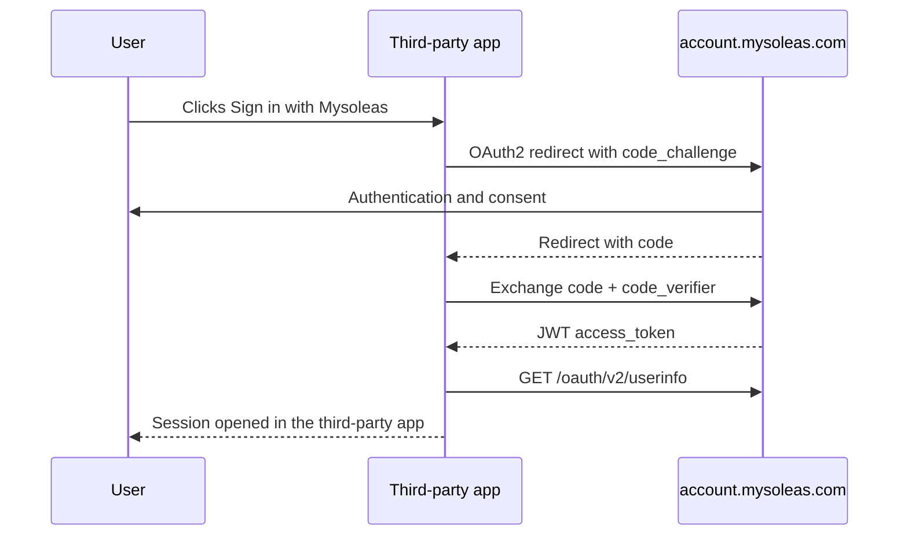

Mysoleas Identity Cloud is the identity service of the Mysoleas ecosystem. You can integrate it into your website, mobile application, or SaaS to manage authentication and user management without rebuilding that whole layer yourself.

In practice, your application can use Mysoleas Identity Cloud to:

- display the **Sign in with Mysoleas** button;
- authenticate a user with OAuth2/OIDC;
- retrieve a JWT and user claims;
- read the user profile with `userinfo`;
- delegate session and identity management to Mysoleas;
- focus on your application's own business logic.

You do not need to call the gateway to use Identity Cloud. The gateway becomes useful only if your application then consumes Mysoleas business services, such as SoleasPay.

The public authentication service is:

```txt
https://account.mysoleas.com
```

The public gateway is optional in an identity-only journey:

```txt
https://api.mysoleas.com
```

## Create an OAuth2 application

Before you use OAuth2, create an application in the Mysoleas dashboard.

1. Create or use a Mysoleas account.
2. Sign in to the dashboard:

```txt
https://mysoleas.com
```

3. Open the OAuth2 applications section.
4. Create a new application.
5. Configure your allowed redirect URLs.
6. Copy the `client_id` and, if your application type allows it, the `client_secret`.
7. Enable the scopes required by your integration.

<Tip>
  For a user-facing web or mobile application, prefer `authorization_code` with PKCE. Never place a `client_secret` in a frontend application.
</Tip>

### SoleasPay application fee configuration

A SoleasPay payment/API application can define `feeBearer` to indicate who pays the fees for direct API payments initiated with its credentials.

This configuration does not concern the OAuth2 client used only for **Sign in with Mysoleas**. It concerns applications that later call payment business services.

| Value | Role |
| --- | --- |
| `CUSTOMER` | Fees are added to the amount paid by the customer |
| `MERCHANT` | Fees are paid by the merchant |
| `null` or absent | The application's historical behavior is preserved |

This configuration is read from the authenticated application. Do not send an arbitrary `applicationId` in a payment to try to change who pays the fees.

## Three different uses

| Use | Domain | Credential obtained | Header used afterward |
| --- | --- | --- | --- |
| Authenticate your users only | `account.mysoleas.com` | User JWT and claims | Your application session |
| Authenticate then call the gateway | `account.mysoleas.com` then `api.mysoleas.com` | User or application JWT | `x-sp-auth-token: Bearer <JWT>` |
| Server-to-server calls to your own backends | `account.mysoleas.com` | Application JWT | Backend-side validation |
| Checkout v4 or Button v4 plugin | `pay.soleaspay.com` or `btn.soleaspay.com` | No JWT | `apiKey` or `data-apikey` |

<Warning>
  If you call the Mysoleas gateway, protected routes do not expect the token in `Authorization`. Send the Bearer JWT in `x-sp-auth-token`.
</Warning>

## Choose the right flow

| Flow | When to use it |
| --- | --- |
| `authorization_code` with PKCE | Website, mobile application, or third-party application that displays **Sign in with Mysoleas** |
| `client_credentials` | Backend, worker, status synchronization, or integration that acts on its own behalf |
| `refresh_token` | Renew a long-lived session without asking for credentials again |

## Integrate Sign in with Mysoleas

The recommended flow for a third-party application is `authorization_code` with PKCE.



Your button must redirect the user to the Mysoleas authorization endpoint with your application's OAuth2 parameters.

```txt
https://account.mysoleas.com/oauth/v2/authorize
```

Common parameters:

| Parameter | Description |
| --- | --- |
| `client_id` | Your OAuth application identifier |
| `redirect_uri` | Return URL authorized in Mysoleas |
| `response_type` | `code` |
| `scope` | Requested permissions, for example `openid profile email payments` |
| `state` | Random value used to protect the callback |
| `code_challenge` | PKCE challenge |
| `code_challenge_method` | `S256` |

## Use Identity Cloud without the gateway

If your application only wants to delegate authentication to Mysoleas, the flow stops after JWT validation and the `userinfo` call.

Your backend can then:

- create or find the local user matching the `sub` claim;
- attach the user to an organization, workspace, or tenant in your application;
- open an application session;
- apply your own roles and permissions;
- continue using your own business APIs without going through `api.mysoleas.com`.

In this mode, Mysoleas Identity Cloud replaces the identity building block of your application. It does not force you to use the gateway.

## Request a token

After the OAuth2 callback, your backend exchanges the `code` for a token.

For a server-to-server integration, use the `client_credentials` grant directly.

```bash
curl -X POST "https://account.mysoleas.com/oauth/v2/token" \
  -H "Content-Type: application/json" \
  -d '{
    "grant_type": "client_credentials",
    "client_id": "YOUR_CLIENT_ID",
    "client_secret": "YOUR_CLIENT_SECRET",
    "scope": "payments services countries providers"
  }'
```

The response follows the OAuth format.

```json
{
  "token_type": "Bearer",
  "expires_in": 3600,
  "access_token": "eyJ..."
}
```

## Call the API

If your application then consumes Mysoleas business services, all protected gateway routes expect the token in `x-sp-auth-token`.

```bash
curl "https://api.mysoleas.com/service/list" \
  -H "x-sp-auth-token: Bearer YOUR_ACCESS_TOKEN" \
  -H "Accept: application/json"
```

## Use context headers

These headers are useful for multi-country integrations, separated environments, and debugging.

| Header | Description |
| --- | --- |
| `x-sp-auth-token` | Required Bearer JWT for the gateway |
| `X-Request-Id` | Trace id created by your system |
| `X-Idempotency-Key` | External idempotency key when the endpoint supports it |
| `X-SP-Country` | Active country, for example `CMR` |
| `X-SP-Environment` | `prod` or `dev` |

## OAuth discovery

You can read OAuth and OIDC metadata.

```bash
curl "https://account.mysoleas.com/.well-known/openid-configuration"
```

This route returns the official token, introspection, revocation, JWKS, and userinfo endpoints.

## Best practices

- Never put `client_secret` in the browser.
- Renew the token before it expires.
- Store tokens in memory or in a vault suited to your backend.
- Use a stable idempotency key for every operation that can be replayed after a timeout.
- Log `transaction_reference`, `invoice_reference`, and `X-Request-Id` together.
