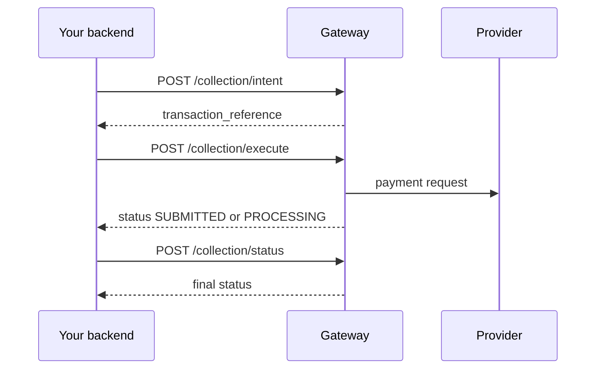

A collection is a Pay-In operation. It debits the customer's wallet or account and credits the merchant's Mysoleas wallet.

## Overview



## 1. Create the intent

```bash
curl -X POST "https://api.mysoleas.com/collection/intent" \
  -H "x-sp-auth-token: Bearer YOUR_ACCESS_TOKEN" \
  -H "Content-Type: application/json" \
  -d '{
    "amount": 2500,
    "currency": "XAF",
    "transaction_uuid": "2f8b9a68-1ad3-4a0c-a187-40b91a4c44a1",
    "provider": "mtn_cmr",
    "channel": "PROVIDER",
    "customer_wallet": "670000000",
    "description": "Order MS-10045"
  }'
```

`transaction_uuid` makes the intent idempotent. If you replay the same payload with the same UUID, Mysoleas returns the same intent.

## 2. Execute

```bash
curl -X POST "https://api.mysoleas.com/collection/execute" \
  -H "x-sp-auth-token: Bearer YOUR_ACCESS_TOKEN" \
  -H "Content-Type: application/json" \
  -d '{
    "transaction_reference": "TRX-20260728-000001",
    "invoice_reference": "MS-10045"
  }'
```

Add `otp` if the selected service has `is_need_otp: true`.

## 3. Verify the status

```bash
curl -X POST "https://api.mysoleas.com/collection/status" \
  -H "x-sp-auth-token: Bearer YOUR_ACCESS_TOKEN" \
  -H "Content-Type: application/json" \
  -d '{ "transaction_reference": "TRX-20260728-000001" }'
```

The call can synchronize the provider status before responding.

## Response fields

| Field | Description |
| --- | --- |
| `transaction_reference` | Mysoleas transaction reference |
| `invoice_reference` | Merchant reference provided during execution |
| `provider_reference` | Reference returned by the provider |
| `status` | Current state |
| `operation` | `COLLECTION` |
| `channel` | `PROVIDER` or `WALLET` |
| `confirmation_method` | `MSISDN`, `LINK`, or `QRCODE` depending on the service |
| `confirmation_url` | URL to present to the customer when confirmation happens by link |

## Split settlement

To distribute a collection, use `settlement_mode: "SPLIT"` in the intent.

```json
{
  "settlement_mode": "SPLIT",
  "distribution": [
    { "matricule": "MS-SELLER-001", "rate": 85 },
    { "matricule": "MS-MARKET-001", "rate": 15 }
  ]
}
```

The split status appears in `split_status` when the payment is eligible.
