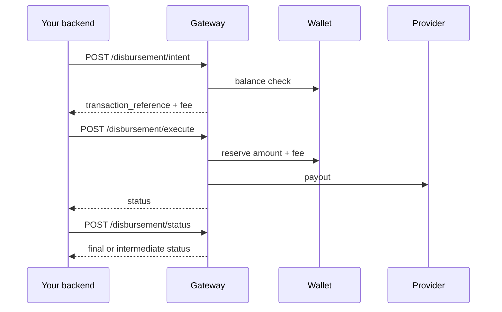

A disbursement is a Pay-Out operation. Mysoleas checks your balance, reserves the amount and fees, executes the transfer with the provider, then releases or settles the funds depending on the result.

## Workflow



## 1. Create the intent

```bash
curl -X POST "https://api.mysoleas.com/disbursement/intent" \
  -H "x-sp-auth-token: Bearer YOUR_ACCESS_TOKEN" \
  -H "Content-Type: application/json" \
  -d '{
    "amount": 10000,
    "currency": "XAF",
    "transaction_uuid": "0798ab17-9f53-4895-9ea3-0c327fa8efb1",
    "provider": "mtn_cmr",
    "channel": "PROVIDER",
    "customer_wallet": "670000000",
    "description": "Refund for order MS-10045"
  }'
```

The response includes `fee` and `required_total`. Your wallet must cover `amount + fee`.

## 2. Execute

```bash
curl -X POST "https://api.mysoleas.com/disbursement/execute" \
  -H "x-sp-auth-token: Bearer YOUR_ACCESS_TOKEN" \
  -H "Content-Type: application/json" \
  -d '{
    "transaction_reference": "TRX-20260728-000021",
    "invoice_reference": "PAYOUT-10045"
  }'
```

During provider execution, funds are reserved. If the provider fails, Mysoleas tries to release the reserved funds.

## 3. Verify the status

```bash
curl -X POST "https://api.mysoleas.com/disbursement/status" \
  -H "x-sp-auth-token: Bearer YOUR_ACCESS_TOKEN" \
  -H "Content-Type: application/json" \
  -d '{ "transaction_reference": "TRX-20260728-000021" }'
```

## Example response

```json
{
  "transaction_reference": "TRX-20260728-000021",
  "environment": "prod",
  "invoice_reference": "PAYOUT-10045",
  "provider_reference": "PROVIDER-998877",
  "status": "PROCESSING",
  "operation": "DISBURSEMENT",
  "channel": "PROVIDER",
  "amount": 10000,
  "currency": "XAF",
  "created_at": "2026-07-28 13:20:10",
  "updated_at": "2026-07-28 13:20:12"
}
```

## Common errors

| Message | Likely cause |
| --- | --- |
| `provider_not_found` | Service inactive, missing, or not authorized for payout |
| `user_wallet_not_found` | No merchant wallet compatible with the currency and country |
| `insufficient_balance` | Available balance is insufficient for `amount + fee` |
| `transaction_not_found` | Reference does not exist or belongs to another tenant |
