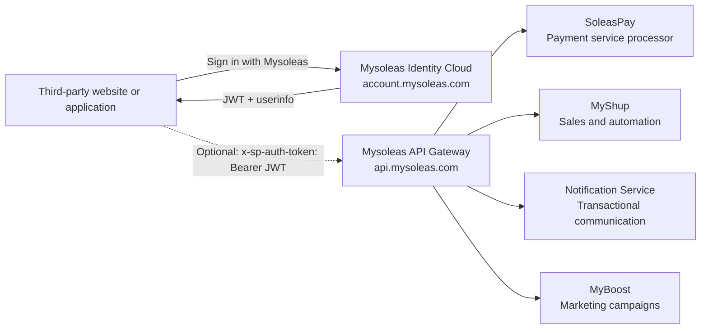

Mysoleas is not a monolithic API. It is an ecosystem of business services exposed through shared infrastructure.

This distinction matters for clean integrations:

- **infrastructure** gives you entry points, identity, security, and routing;
- **business domains** carry business capabilities: payments, sales, communication, marketing, and user management.

## Mental model



## Mysoleas infrastructure

Infrastructure is the transversal layer. It does not replace business products. It makes them accessible in a unified way.

| Component | Domain | Role |
| --- | --- | --- |
| Mysoleas API Gateway | `https://api.mysoleas.com` | Single entry point for protected business routes |
| Mysoleas Identity Cloud | `https://account.mysoleas.com` | OAuth2/OIDC authentication, user management, JWT, user profile, and sign-in button |

The gateway receives requests from your applications, verifies the security context, then routes to the right business domain.

<Warning>
  All gateway routes expect a Bearer JWT in the `x-sp-auth-token` header.
</Warning>

```bash
curl "https://api.mysoleas.com/service/list?country=CMR&currency=XAF" \
  -H "x-sp-auth-token: Bearer YOUR_ACCESS_TOKEN" \
  -H "Accept: application/json"
```

## Business domains

Each business domain has its own vocabulary, objects, and flows.

| Domain | Product | What it enables |
| --- | --- | --- |
| Payments | SoleasPay | Payment aggregation, collections, disbursements, payment links, subscriptions, providers, and services |
| Identity | Mysoleas Identity Cloud | User sign-in, user management, OAuth2, OIDC, JWT, claims, profile, and third-party applications |
| Sales | MyShup | Products, orders, multi-product carts, merchant journeys, and sales automation |
| Communication | Notification Service | Transactional notifications, system messages, contacts, audiences, and V2 marketing campaigns |
| Marketing | MyBoost | Boost campaigns, UGC challenges, promotions, customer activation, and marketing follow-up |

## SoleasPay in the gateway

SoleasPay is the payment service processor of the ecosystem. In this documentation, the covered gateway routes mainly concern SoleasPay.

Use these route families to:

- list available countries;
- list payment services;
- verify provider status;
- create and track collections;
- create and track disbursements;
- create and manage payment links;
- create and manage subscriptions.

These routes go through:

```txt
https://api.mysoleas.com
```

They use:

```txt
x-sp-auth-token: Bearer <JWT>
```

## Mysoleas Identity Cloud

Mysoleas Identity Cloud is a full service. It lets you integrate the **Sign in with Mysoleas** button into a third-party website or application.

You can use it as a standalone authentication service. In that case, your application authenticates the user through Mysoleas, reads their claims, opens its own session, and continues with its own business logic without calling the gateway.

To create an OAuth2 application, sign in to the Mysoleas dashboard:

```txt
https://mysoleas.com
```

Configure your application, redirect URLs, and authorized scopes before starting the OAuth2 flow.

The recommended flow for a web application is OAuth2 `authorization_code` with PKCE:

1. Your application displays **Sign in with Mysoleas**.
2. The user is redirected to `account.mysoleas.com`.
3. Mysoleas authenticates the user and requests consent if needed.
4. Your application receives a `code`.
5. Your backend exchanges the `code` for a JWT.
6. Your application opens a local session or calls the gateway with `x-sp-auth-token` if it consumes a Mysoleas business service.

For a backend that acts on its own behalf, use `client_credentials`.

## SoleasPay v4 plugins

`Checkout v4` and `Button v4` plugins are deliberately simpler.

They let you integrate SoleasPay quickly into a third-party application with a merchant `apikey`, without OAuth2, without JWT, and without manual gateway calls.

| Plugin | Authentication | When to use it |
| --- | --- | --- |
| Checkout v4 | `apiKey` | Redirect the customer to the hosted checkout at `https://pay.soleaspay.com` |
| Button v4 | `data-apikey` | Display the JavaScript button from `https://btn.soleaspay.com/main.js` in your page |

If you build a complete payment journey with your own backend calls, use the gateway. If you want a fast payment integration with very little code, use the v4 plugins.
