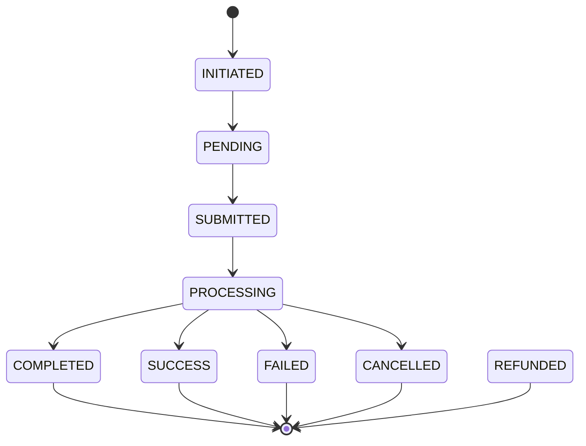

The status is the source of truth for your integration. Never validate an order only because the execution call returned HTTP `200`.

## Which endpoint to use

| Transaction | Status endpoint |
| --- | --- |
| Standard collection | `POST /collection/status` |
| Standard disbursement | `POST /disbursement/status` |
| Plugin collection | `POST /merchand/status` |
| Payment link payment | Use the returned `transaction_reference`, then the collection status |
| Subscription payment | `GET /billing/subscription-payments/{reference}` |

## Standard lifecycle

## Non-final states

| Status | Recommended action |
| --- | --- |
| `INITIATED` | Wait for execution or retry `execute` if your system lost the response |
| `PENDING` | Continue polling |
| `SUBMITTED` | The provider received the request; continue polling |
| `PROCESSING` | The provider is processing; continue polling with backoff |

## Final states

| Status | Recommended action |
| --- | --- |
| `COMPLETED` | Mark the transaction as successful |
| `SUCCESS` | Mark the transaction as successful |
| `FAILED` | Mark the transaction as failed |
| `CANCELLED` | Mark the transaction as cancelled |
| `REFUNDED` | Mark the transaction as refunded |

## Polling strategy

A simple strategy is enough in most cases.

| Time window | Recommended frequency |
| --- | --- |
| 0 to 60 seconds | Every 5 seconds |
| 1 to 5 minutes | Every 15 seconds |
| 5 to 30 minutes | Every 60 seconds |
| After 30 minutes | Every 5 minutes or manual handling |

Stop polling as soon as a final state is returned.

## Idempotency and recovery

Store these references together:

| Reference | Generated by | Usage |
| --- | --- | --- |
| `transaction_uuid` | Your system | Prevent duplicate intents |
| `transaction_reference` | Mysoleas | Execute and track the transaction |
| `invoice_reference` | Your system | Link the transaction to your invoice |
| `provider_reference` | Provider | Provider diagnostics and support |

If your `execute` call times out, call `status` first with `transaction_reference`. Retry `execute` only if the status shows that the operation has not yet been submitted.
